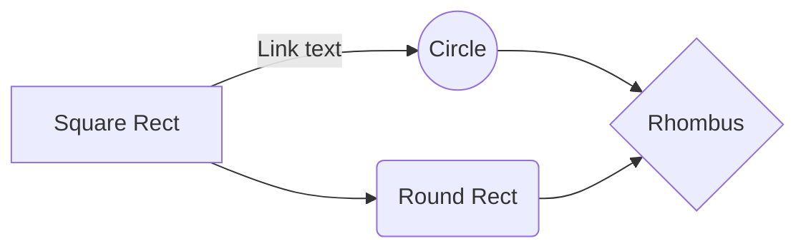
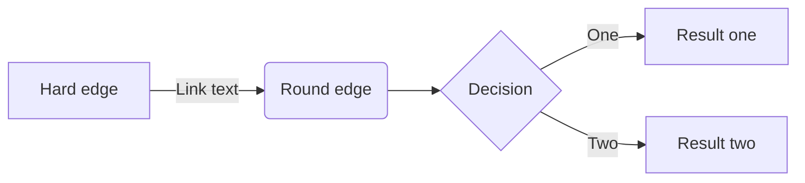

{width=100px height=100px}

# Audio digitale - breve storia delle DAW e il loro utilizzo
Cenni sull'audio digitale e breve evoluzione storica e panoramica di utilizzo dei software per la produzione, mix e master di audio digitale.

## Introduzione

Il progetto ha come obiettivo la creazione di un eBook con cenni sull'audio digitale, sulla storia e sull'utilizzo dei software per la creazione e produzione dell'audio digitale.
Il seguente prodotto editoriale è rivolto a un pubblico di neofiti e curiosi, che vogliono ampliare la propria cultura personale in materia. È adatto a chiunque voglia avvicinarsi al mondo dell'audio digitale e delle DAW in modo graduale senza scendere troppo nel dettaglio e nei tecnicismi.
Le tecnologie adottate per la realizzazione del seguente eBook sono:

- **LaTeX** per la scrittura del contenuto dell'ebook.
- **LLM** (nella fattispecie GPT-4o) per la creazione di parte dei contenuti in maniera automatica mediante adeguato prompt engineering.
- **pandoc** per la trasformazione di formato (dal documento LaTeX al prodotto editoriale finito in formato ePub).
- **ePub** formato per la distribuzione del prodotto editoriale finale.

La raccolta documentale ha principalmente incluso l'interazione con il LLM di OpenAI: GPT-4o. Il contenuto dell'ebook è stato quasi interamente generato tramite AI, con prompt engineering adeguato e con correzione e finalizzazione umana al termine della generazione dei testi.

Il risultato raggiunto è quello di un "tascabile digitale": un ebook leggero, discorsivo e adatto a chiunque. Si tratta di un testo ben strutturato, diviso per punti e con nozioni semplici ma mai banali.

## Ideazione 

### Tema

Lo scopo di questo prodotto editoriale è quello di esprimere in maniera semplice ed esausitiva dei concetti base sull'audio digitale e sui software in grado di manipolare e produrre audio digitale. Non si tratta quindi di un manuale, un volume tecnico, quanto più una lettura leggera, di passatempo. L'obiettivo è quello di cercare di avvicinare al mondo dell'audio digitale e della sua manipolazione i neofiti e tutti coloro che sono alle prime armi; in definitiva il pubblico adatto a questo prodotto editoriale è quindi poco esperto nel campo.
"Audio digitale - breve storia delle DAW e il loro utilizzo" è quindi un "tascabile digitale", una prima lettura sull'argomento, seguita poi eventualmente da letture più approfondite e tecniche.

I temi affrontati dal prodotto sono principalmente due: audio digitale e software per la produzione audio (DAW). Per quanto riguarda l'audio digitale, campo molto esteso e carico di tecnicismi non adatti a un lettore inesperto, vengono trattate solamente le basi, per introdurre al lettore concetti necessari per comprendere la sezione successiva sulle DAW. 
Riguardo l'audio digitale vengono quindi espressi solo dei concetti, preceduti da un breve parentesi storica sull'argomento, giusto per inquadrare il periodo storico di sviluppo. I concetti espressi riguardano definizione di audio digitale, campionamento, quantizzazione, formati di file, codifiche, caratteristiche dell'audio digitale e infine una sezione sul ruolo dell'audio digitale in era moderna.  

La sezione più corposa del prodotto editoriale è quella riguardo le DAW. I temi trattati in questa sezione sono: introduzione alle DAW e il loro utilizzo, parentesi storica e di sviluppo, differenze rispetto alla controparte analogica. Il libro ha termine con un elenco di DAW più utilizzate e una sezione sulle prospettive e gli sviluppi futuri.

Per avere una panoramica del materiale già a disposizione del lettore la ricerca sullo stato dell'arte riguardo gli argomenti trattati è stata effettuata mediante il tool di ricerca avanzata di Google.
Riguardo la **ricerca sull'audio digitale** la ricerca effettuata è la seguente:
"audio digitale" nella campo di ricerca *tutte queste parole:*

Riguardo la **ricerca sui software DAW** le ricerche sono state le seguenti:

- "DAW" nel campo di ricerca *tutte queste parole:*
- "storia delle DAW" nel campo di ricerca *tutte queste parole:*
- "cos'è una DAW" nel campo di ricerca *tutte queste parole:*
- "a cosa serve una DAW" nel campo di ricerca *tutte queste parole:*
- "daw più utilizzate" nel campo di ricerca *tutte queste parole:*
- "innovazioni delle daw" nel campo di ricerca *tutte queste parole:*
- "futuro della produzione audio" nel campo di ricerca *tutte queste parole:*

Come tool di monitoraggio del pubblico è stato utilizzato [**Answer The Public**](https://answerthepublic.com).
La ricerca è stata effettuata su:

- "audio digitale"
- "digital audio workstation"

I risultati della ricerca sono presenti nella seguente repository di GitHub: [**Link al repository**](https://github.com/andreacasati19/Audio-digitale---breve-storia-delle-DAW-e-il-loro-utilizzo/tree/main/relazione/monitoraggio)

### Destinatari

Il seguente prodotto editoriale, come già accennato, si rivolge a un pubblico di neofiti e curiosi che desiderano approcciare l'argomento con una lettura semplice e ampliare la propria cultura personale.

Per la descrizione delle *personas* e del pubblico potenziale per il prodotto editoriale in questione è stato deciso di sviluppare i seguenti aspetti descrittivi dei personaggi: nome, età, professione, istruzione, interessi, luogo di residenza, stile di vita, obiettivi, esperienza con l'audio digitale, punti di forza, bisogni, sfide, motivazioni, comportamenti online. In ultimo è stato deciso di aggiungere una citazione personale, come se il personaggio potesse parlare e descriversi in una frase.
I personaggi (in questo caso tre) sono di fantasia, a cura della sensibilità del creatore.
Le descrizioni delle personas sono presenti nella seguente repository di GitHub: [**Link al repository**](https://github.com/andreacasati19/Audio-digitale---breve-storia-delle-DAW-e-il-loro-utilizzo/tree/main/relazione/personas)

### Requisiti di accettazione

Per valutare i requisiti di accettazione di questo prodotto editoriale da parte dei destinatari già specificati è necessario analizzare due aspetti: *utilità percepita* e *facilità d'uso*.
Come già accennato il prodotto editoriale in questione si pone l'obiettivo di gettare le basi su dei temi complicati e molto tecnici. Ha come obiettivo quello di creare una base di conoscenza sugli argomenti per poi eventualmente essere seguito da letture più approfondite in materia. Pertanto è necessario che il libro soddisfi a livello di utilità percepita e di facilità d'uso i requisiti appena esposti.  
Dal punto di vista dell'utilità percepita, essendo il volume un *tascabile digitale*, deve porsi in modo semplice, con schema passo-passo, senza troppi tecnicismi. Deve essere semplice ma non banale. Deve esporre in modo chiaro, semplice ma non semplicistico. Il prodotto deve quindi affrontare i temi passo dopo passo, aggiungendo informazioni e tecnicismi (seppur pochi e basilari) gli uni dopo gli altri. La struttura del volume deve essere: dal generale al particolare.  
Dal punto di vista della facilità d'uso è importante l'utilizzo del linguaggio: deve essere semplice, discorsivo ma anche schematico. È importante che vi siano sezioni discorsive, per accompagnare il lettore, ma anche sezioni a punto-elenco, per non annoiare il lettore e rendere la lettura più fruibile e schematica.

L'aspetto di innovazione è quello di provare rendere semplici e intuitive informazioni complesse, quasi sempre distribuite solo su piattaforme o prodotti editoriali adatti a esperti del settore e non certamente per neofiti e curiosi.

### Canali di distribuzione

L'obiettivo, come già specificato, è quello di creare un *tascabile digitale*. Il formato è quindi quello di un eBook, più adatto anche visti gli argomenti trattati riguardo la *tecnologia* in senso ampio.  
I canali di distribuzione possono essere: market place, book store online, web e in generale Internet. Il formato più adatto a questo tipo di distribuzione è il formato ePub; non sono esclusi però anche altri tipi di formato quali WebBook e PDF.

Dal punto di vista dello stile grafico l'intenzione generale è quella di catturare l'attenzione del lettore inesperto: troppe parole senza grafici, immagini e in generale senza uno stile visuale accattivante rischiano di far perdere l'attenzione del lettore.  
L'identità visuale in questo tipo di contenuti (poco tecnici e adatti al pubblico *pop*) è fondamentale. Lo stile sarà orientato verso un'espressione informale, senza compromettere il significato.

Il seguente prodotto editoriale potrebbe essere inserito in una *collana editoriale digitale*: una raccolta di *tascabili digitali* con lo scopo di rendere accessibili a un pubblico inesperto e curioso temi specifici e di nicchia. Il progetto editoriale potrebbe quindi essere sviluppato anche in una serie di podcast e in formati non necessariamente atti alla lettura.

## Processo di Produzione

### Acquisizione dei contenuti
Descrivere le fonti che saranno utilizzate nella costruzione del prodotto editoriale. Nella scelta delle fonti valutare il costo di acquisizione: (i) disponibili come fonti libere, (ii) generabili automaticamente, (iii) richiedono un lavoro di redazione manuale.

### Gestione documentale

Descrivere il *flusso di gestione documentale* definito per il progetto. Ad esempio, (i) la raccolta o produzione dei contenuti, (ii) la valutazione dei diritti, (iii) la trasformazione dei formati, (iv) la strutturazione dei contenuti, (v) l'applicazione dello stile grafico, (vi) la generazione dei metadati, (vii) la distribuzione dei contenuti. Nella descrizione del flusso considerare le  fasi di revisione, controllo e approvazione che possono richiedere le diverse fasi.

> LM2 slide 14-26

### Tecnologie adottate

Descrivere le tecnologie addottate nelle diverse fasi e discuterne il contributo in termini di raggiungimento degli obiettivi descritti negli scenari d'uso.

|                |Scenario 1                          |Scenario 2                       |
|----------------|-------------------------------|-----------------------------|
|Markdown |`'Isn't this fun?'`            |'Isn't this fun?'            |
|XSLT       |`"Isn't this fun?"`            |"Isn't this fun?"            |
|ePud         |`-- is en-dash, --- is em-dash`|-- is en-dash, --- is em-dash|

### Esecuzione del flusso
Allegare, possibilmente attraverso il riferimento ad un repository documentale, i materiali, gli script, le configurazioni, che permettono di riprodurre il flusso di produzione documentale. I contenuti non devono necessariamente essere completi, può essere sufficiente fornire un prototipo per ogni tipologia di contenuto previsto e per ogni formato di destinazione previsto.  

## Valutazione dei risultati raggiunti

### Valutazione del flusso di produzione

Per valutare il contributo proposto valutare le diverse fasi del flusso in termini di (i) riduzione dei tempi di gestione documentale, (ii) riduzione degli errori, (iii) miglioramento della qualità dei documenti, (iv) miglioramento del livello di accettazione della tecnologia, (v) raggiungimento di nuovi canali di distribuzione, (vi) soddisfacimento di nuovi scenari d'uso.
 
### Confronto con lo stato dell'arte

Può anche essere utile confrontare una versione ASIS del flusso di gestione, senza la tecnologia o le innovazioni proposte, e una TOBE che include la tecnologia e le innovazioni proposte dallo studente.

### Limiti emersi

È importante sottolineare i limiti emersi. Come l'impossibilità di accesso ad alcune tecnologie o fasi del flusso di gestione documentale, limiti nella automazione di alcune passi di trasformazione dei formati o di integrazione delle sorgenti

## Conclusioni

Discutere i risultati ottenuti, verificando se gli obiettivi definiti dai casi d'uso siano pienamente o parzialmente raggiunti. Evidenziare gli aspetti nei quali si sono raggiunti i risultati più soddisfacenti e le limitazioni emerse.

## Bibliografia e sitografia

Elencare i riferimenti bibliografici e risorse online che hanno maggiormente contribuito alla realizzazione del progetto. Ad esempio [@sechi2010,@pantieri2021,@ceravolo2023]

